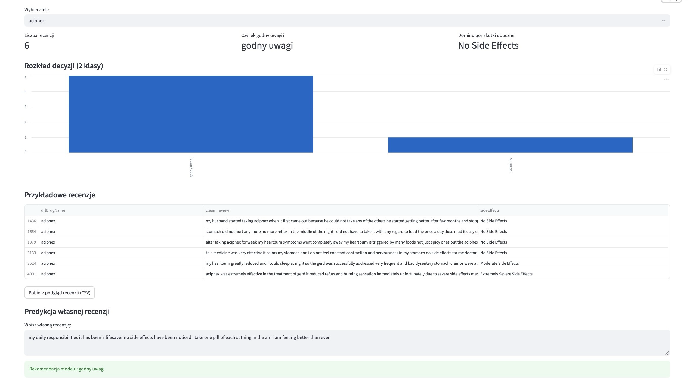

# 💊 DrugSentiment_POS_NER

This project builds an end-to-end NLP pipeline for drug review analysis: from data preprocessing and multi-class sentiment modeling to a practical Streamlit recommendation interface. It combines transparent 3-class evaluation for analysis quality with a calibrated 2-class decision layer for safer end-user recommendations.

## TL;DR
- End-to-end NLP project for drug review sentiment analysis on UCI Drug Review data (`id=461`).
- Main scientific evaluation is **3-class sentiment** (`negative`, `neutral`, `positive`) with `StratifiedKFold`.
- Product-facing output in Streamlit is **2-class recommendation** (`raczej nie` vs `godny uwagi`).
- The 2-class decision uses a **calibrated threshold** (not fixed `0.5`) for safer recommendations.

## App Preview


## Key Results (Latest Local CV Run)
| Setup | Accuracy | F1 (weighted) | Balanced Accuracy | MCC | Cohen's Kappa |
|---|---:|---:|---:|---:|---:|
| 3-class (primary) | 0.6641 | 0.6750 | 0.5212 | 0.3461 | 0.3439 |
| 2-class (Streamlit mapping) | 0.7372 | 0.7402 | 0.7131 | 0.4162 | 0.4149 |

## Business Rule (Safety First)
- For end users, `neutral` is grouped with `negative` as **`raczej nie`**.
- This conservative mapping reduces the risk of over-recommending uncertain drugs.
- Final binary decisions are made from probabilities with a calibrated threshold selected on a validation split.

## Modeling Decisions
- **Data source:** UCI Drug Review dataset (`fetch_ucirepo(id=461)`).
- **Text features:** TF-IDF (`max_features`, n-grams, stop words), optional POS-filtered variant.
- **Models compared:** Logistic Regression and Linear SVM.
- **Imbalance strategy:** SMOTE when available; robust oversampling fallback otherwise.
- **Evaluation depth:** accuracy, precision/recall/F1, balanced accuracy, MCC, Cohen's kappa, confusion matrix, misclassification analysis.
- **Reliability step:** `StratifiedKFold` for 3-class primary evaluation (+ 2-class consistency view).

## Reproducibility
### 1) Run Notebook
- Open `DrugSentiment_POS_NER.ipynb`.
- Run cells top-to-bottom:
  - preprocessing and feature engineering,
  - model comparison and diagnostics,
  - `StratifiedKFold: 3 klasy + 2 klasy`,
  - `Final metrics snapshot z walidacji krzyżowej`.

### 2) Run Streamlit App
```bash
python3 -m streamlit run "drug_sentiment_streamlit.py" --server.address 127.0.0.1 --server.port 8502
```

### 3) Expected Output
- Drug-level dashboard with:
  - binary recommendation (`Czy lek godny uwagi?`),
  - decision confidence,
  - calibrated threshold,
  - sentiment distribution and example reviews,
  - CSV export button.

## Limitations
- Dataset class imbalance still affects 3-class difficulty.
- Reviews are user-generated and noisy (subjective language, sparse context).
- Current split strategy is random; temporal split is not enforced.
- No transformer benchmark in this version (CPU-friendly classical ML focus).

## Next Improvements
- Add temporal validation to better approximate real-world deployment.
- Add lightweight transformer baseline (`DistilBERT`) for comparison.
- Add monitoring-style drift checks for incoming review text over time.
- Package the calibration report into a small artifact for model governance.

## Project Structure
- `DrugSentiment_POS_NER.ipynb` - full analysis pipeline and experiments.
- `drug_sentiment_streamlit.py` - interactive 2-class recommendation app.
- `screenshot.png` - app screenshot used in README.
- `README.md` - project documentation.
